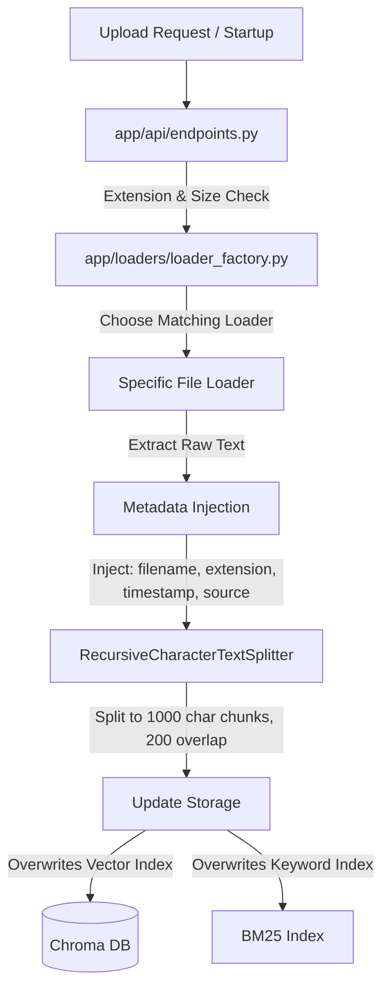
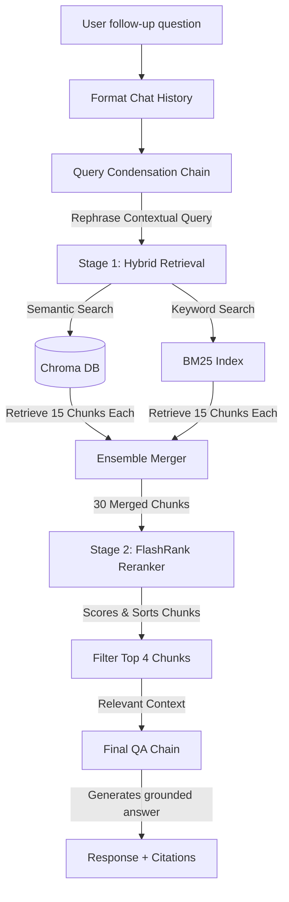

# Intelligent Hybrid RAG Playbook Assistant: Comprehensive Documentation

This documentation provides an all-in-one technical reference for the RAG Pro application, detailing the system architecture, file ingestion workflow, conversational query pipeline, technology stack, and directory structure.

---

## 📂 1. Directory Structure & Architecture

The application is structured using Clean Architecture principles to separate the API routing, business services, document ingestion loader factory, and utility modules.

```
rag_pro/
│
├── server.py                 # Main entrypoint; launches FastAPI & mounts routes
├── requirements.txt          # Python dependencies
├── .env                      # API keys & tunable search parameters
│
├── app/
│   ├── __init__.py           # Package initializer
│   │
│   ├── api/
│   │   ├── __init__.py       # Exposes router
│   │   └── endpoints.py      # /upload, /status, /query routes & input validation
│   │
│   ├── services/
│   │   ├── __init__.py       # Exposes service functions
│   │   └── rag_service.py    # Core RAG logic: indexing, hybrid search, rerank, memory
│   │
│   ├── loaders/
│   │   ├── __init__.py       # Exposes get_document_loader factory
│   │   ├── loader_factory.py # Centralized loader selection & size/existence checks
│   │   ├── pdf_loader.py     # Wraps PyPDFLoader
│   │   ├── docx_loader.py    # Wraps Docx2txtLoader
│   │   ├── csv_loader.py     # Wraps CSVLoader
│   │   ├── ppt_loader.py     # Wraps UnstructuredPowerPointLoader
│   │   ├── html_loader.py    # Wraps UnstructuredHTMLLoader
│   │   ├── markdown_loader.py# Wraps UnstructuredMarkdownLoader
│   │   └── text_loader.py    # Wraps TextLoader (Plain Text)
│   │
│   └── utils/
│       ├── __init__.py       # Exposes logger
│       └── logger.py         # Standardized logging setup
│
├── uploaded_files/           # Raw documents uploaded by the user
├── chroma_db/                # Persistent vector database store
└── static/                   # Frontend UI files (HTML, CSS, JS)
```

---

## ⚙️ 2. Workflow Pipelines

The application is split into two primary workflows: **Document Ingestion (Index Rebuilding)** and **Conversational Query & Retrieval (Q&A)**.

### A. Document Ingestion Pipeline

When a file is uploaded (or the server starts up), the system scans the [uploaded_files](file:///c:/Users/MekaKishore/workspaces/RAG/rag_pro/uploaded_files) directory and updates the search indices:



1. **API Validation**: The `/upload` endpoint inspects the file:
   * Verifies the file extension is supported.
   * Confirms the file is not empty (size > 0 bytes).
2. **Dynamic Loader Factory**: [loader_factory.py](file:///c:/Users/MekaKishore/workspaces/RAG/rag_pro/app/loaders/loader_factory.py) chooses the appropriate LangChain loader wrapper dynamically (avoiding inline `if-else` blocks in the service layer).
3. **Text Extraction & Metadata Enrichment**: Raw text is extracted. We inject core metadata keys (`filename`, `extension`, `upload_timestamp`, `source`) into each document object.
4. **Chunking**: Text is split into chunks of up to 1000 characters (with 200 character overlap) using `RecursiveCharacterTextSplitter`. This fits the context window and provides optimal retrieval sizes.
5. **Indexing**: 
   * Semantic vectors are generated via HuggingFace and saved to a local [chroma_db](file:///c:/Users/MekaKishore/workspaces/RAG/rag_pro/chroma_db) directory.
   * Text is parsed into a keyword search BM25 index.

---

### B. Conversational Query & Retrieval Pipeline

When you ask a question in the chat UI, the system runs a multi-stage conversational RAG flow:



1. **Conversational Memory (Query Condensation)**:
   * If there is active chat history, the system passes the chat log and the raw follow-up question to the LLM.
   * The LLM rewrites the query into a **standalone, context-complete question** (e.g., rephrasing *"What about under 1 year?"* to *"What is the parental leave policy for employees under 1 year of employment at Company XYZ?"*).
2. **Stage 1 - Hybrid Search (High Recall)**:
   * The standalone query is sent to both the **Semantic Retriever** (Chroma DB) and the **Keyword Retriever** (BM25).
   * Both retrievers fetch a high recall pool of candidate documents (`RETRIEVER_TOP_K=15` each).
   * The `EnsembleRetriever` merges these documents together, applying configured weights (default 50% semantic, 50% keyword).
3. **Stage 2 - Contextual Reranking (High Precision)**:
   * The merged pool of 30 candidate chunks is sent to the local **FlashRank Reranker** cross-encoder model.
   * FlashRank re-scores every chunk according to its direct answerability to the question.
   * The pipeline selects only the top 4 highest-scoring chunks (`RERANKER_TOP_N=4`).
4. **Context-Aware Generation**:
   * The top 4 context chunks, the formatted chat history, and the user's raw question are sent to the final Llama 3.1 LLM chain on Groq.
   * The LLM generates a grounded answer based *only* on the context, returning the response alongside file and page citations.

---

## 🛠️ 3. Technology Stack & Modules Used

The project relies on a modern, lightweight, high-performance RAG stack:

| Component | Technology / Module | Purpose |
| :--- | :--- | :--- |
| **API Framework** | `FastAPI` (Python) | Handles file uploads, server status, and query endpoint routes. |
| **Server Engine** | `Uvicorn` | Lightweight ASGI web server runner. |
| **RAG Orchestrator** | `LangChain` | Ties retrievers, prompt templates, chains, and LLM providers together. |
| **Vector Database** | `ChromaDB` (`langchain-chroma`) | Locally saves and searches document embeddings. |
| **Embeddings Model** | HuggingFace `sentence-transformers/all-MiniLM-L6-v2` | Converts raw text chunks into 384-dimensional semantic vectors. |
| **Keyword Search** | `BM25Retriever` (`rank_bm25`) | Handles keyword search matching for exact terms. |
| **Hybrid Merger** | `EnsembleRetriever` | Combines semantic and keyword searches using custom weights. |
| **Reranker Engine** | `FlashRank` (`flashrank`) | Extremely fast, local CPU-friendly cross-encoder model to re-score context chunks. |
| **LLM Provider** | `Groq Cloud API` (`ChatGroq`) | Runs inference on `llama-3.1-8b-instant` for query rephrasing and final generation. |
| **Frontend UI** | Vanilla HTML5 / CSS3 / ES6 JS | Browser client interface with drag-drop uploads, sidebar library, and chat logs. |

---

## ⚙️ 4. Configuration & Environment Variables

All parameters governing the behavior of the retrievers and APIs are configured in the [.env](file:///c:/Users/MekaKishore/workspaces/RAG/rag_pro/.env) file:

```env
# API Access Credentials
GROQ_API_KEY=gsk_...

# Stage 1 Retrieval Sizing
RETRIEVER_TOP_K=15

# Stage 2 Final Chunks passed to LLM
RERANKER_TOP_N=4

# Hybrid Search Weight Distribution (Must add up to 1.0)
HYBRID_SEMANTIC_WEIGHT=0.5
HYBRID_KEYWORD_WEIGHT=0.5
```


next - learning and improvements for end to end rag knowledge 

1. Semantic Chunking (Done)
2. Parent Document Retriever
3. MultiQueryRetriever
4. Contextual Compression Retriever (Done)
5. SelfQueryRetriever
6. OCR & Table Extraction
7. Incremental Indexing (Done)
8. Redis Caching
9. Streaming Responses (Done)
10. RAG Evaluation (Ragas)
11. PostgreSQL + pgvector / Qdrant
12. LangGraph & Agentic AI