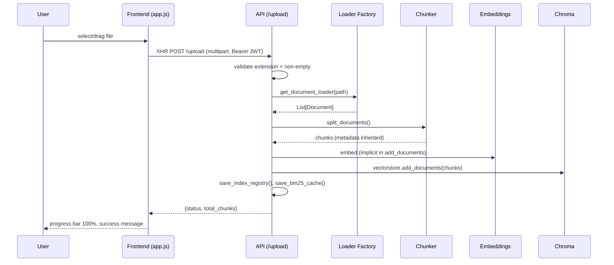
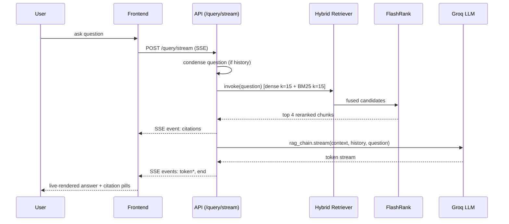
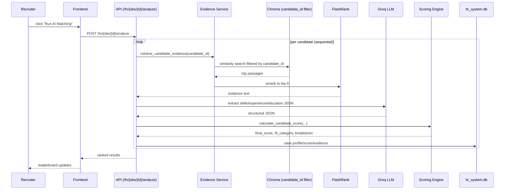
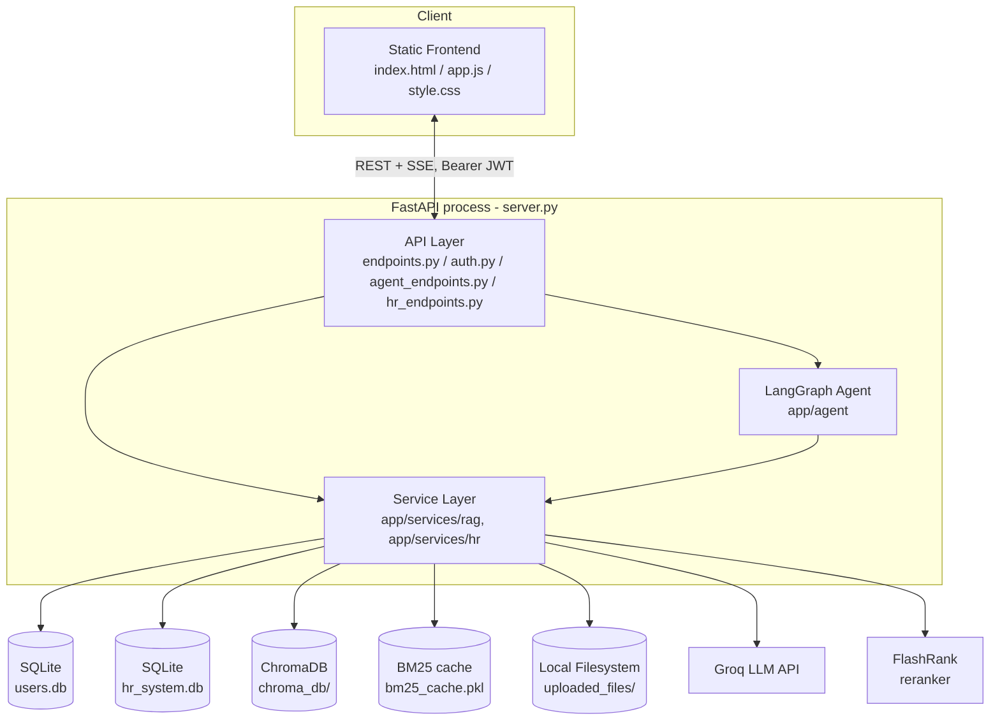

# RAG Pro — Complete System Architecture, Workflow & Technical Documentation

> Codebase-grounded. Every claim below is traced to a file, class, or function in `C:\Users\MekaKishore\workspaces\RAG\rag_pro`. Items the code does not support are marked **Not Implemented**; items that couldn't be fully confirmed are marked **Needs Verification**.

---

## 1. Executive Overview

**What RAG Pro actually is:** a single-process **FastAPI** application (`server.py`) that bundles two distinct products behind one backend and one static frontend:

1. **A document Q&A chatbot** — upload PDFs/DOCX/CSV/PPTX/HTML/Markdown/TXT files, then ask natural-language questions answered via **hybrid retrieval (dense Chroma + BM25) → FlashRank reranking → Groq LLM generation**, with inline citations (source file + page).
2. **An AI HR Candidate Matcher** — recruiters create a "job," upload a job description and a batch of resumes, the system parses both with an LLM, retrieves supporting evidence from each resume via vector search, scores every candidate with a deterministic weighted formula, and shows a ranked leaderboard with shortlisting.

Both products are wrapped by a **LangGraph conversational agent** (`app/agent/`) that classifies user intent and dispatches to tools — the RAG chatbot and the HR matcher are each exposed to the agent as a callable "tool," plus tools for interview-question generation and candidate email drafting (gated by a human-approval step).

**Problem it solves:** manually searching long documents for answers, and manually reading/comparing dozens of resumes against a job description.

**Who/what uses it:** a single authenticated user type (JWT-based accounts, no roles) through a browser-based chat/dashboard UI (`static/`).

**High-level workflow:**
```
User → static/app.js (browser) → FastAPI (server.py) → Service layer (app/services) →
  SQLite (users/HR) + Chroma (vectors) + Groq LLM → JSON/SSE response → DOM update
```

**Major capabilities actually implemented:** multi-format document ingestion, incremental re-indexing, hybrid (dense+BM25) retrieval, FlashRank reranking, streaming chat answers with citations, JWT auth, resume/JD parsing via LLM, deterministic candidate scoring, skill normalization, leaderboard + shortlisting, a LangGraph agent with human-in-the-loop approval for "send email" actions.

**Capabilities that are documented but NOT working**, confirmed by code inspection (see later sections for detail): the HR chat endpoint (`/hr/jobs/{id}/chat`) 500s due to a missing attribute; the entire "v2"/"Phase 2" HR API (`hr_endpoints_v2.py` and its dependencies) fails to import; Docker/CI-CD described in `README.md` does not exist in the repo.

---

## 2. Complete Technology Stack

| Layer | Technology | Purpose | Where Used |
|---|---|---|---|
| Web framework | FastAPI | HTTP API, routing, Pydantic validation | `server.py`, `app/api/*.py` |
| ASGI server | Uvicorn | Runs the FastAPI app | run via `python -m uvicorn server:app` |
| Frontend | Vanilla HTML/CSS/JS (no framework, no build step) | Chat UI, HR dashboard, auth modal | `static/index.html`, `static/app.js`, `static/style.css` |
| Icons/fonts | Lucide (CDN), Google Fonts (CDN) | UI icons/typography | `static/index.html` |
| Database (relational) | SQLite, raw `sqlite3` (no ORM) | Users, HR jobs/candidates/scores/evidence | `app/db/base_db.py`, `user_db.py`, `hr_db.py`; files `app/db/users.db`, `app/db/hr_system.db` |
| Vector DB | ChromaDB (via `langchain-chroma`) | Embedding storage + similarity search | `app/services/rag/retrieval_service.py`, dir `chroma_db/` |
| Keyword search | `rank_bm25` (`BM25Retriever`) | Sparse/keyword half of hybrid search | `app/services/rag/retrieval_service.py` |
| Embeddings | `sentence-transformers/all-MiniLM-L6-v2` via `langchain_huggingface.HuggingFaceEmbeddings` | Text → vector | `app/services/rag/ingestion_service.py` |
| LLM | Groq (`ChatGroq`), default model `llama-3.3-70b-versatile` | Generation, intent classification, JD/resume parsing, scoring extraction | `app/core/llm_factory.py`, `app/agent/llm.py` |
| Agent orchestration | LangGraph (`StateGraph`, `MemorySaver`) | Multi-step conversational agent with human approval gate | `app/agent/graph.py`, `app/agent/nodes/*` |
| Chaining | LangChain / `langchain-classic` | Retrievers, `EnsembleRetriever`, `ContextualCompressionRetriever`, prompt chains | `app/services/rag/*`, `app/agent/*` |
| Reranking | FlashRank (`FlashrankRerank`, cross-encoder `ms-marco-*`) | Re-ranks hybrid search results before generation / HR evidence | `app/services/rag/reranking_service.py`, `app/services/hr/evidence_cache_service.py` |
| Document loaders | `pypdf`, `docx2txt`, `unstructured`, `beautifulsoup4`, `python-pptx` via LangChain community loaders | Extract text from PDF/DOCX/PPTX/HTML/MD | `app/loaders/*.py` |
| Chunking | `langchain_text_splitters.RecursiveCharacterTextSplitter`, `langchain_experimental.text_splitter.SemanticChunker` | Split documents into chunks | `app/services/rag/ingestion_service.py` |
| File storage | Local filesystem | Uploaded documents/resumes/JDs | `uploaded_files/`, `settings.UPLOAD_DIR` |
| Cache | In-process Python dict/pickle (no Redis) | BM25 index cache, evidence-retrieval cache | `chroma_db/bm25_cache.pkl`, `app/services/hr/evidence_cache_service.py` |
| Auth | Custom JWT (`PyJWT`) + PBKDF2-HMAC password hashing | Login/registration/session | `app/core/security.py`, `app/api/auth.py`, `app/services/auth/auth_service.py` |
| Logging | Python stdlib `logging` (console only) | App/event logging | `app/utils/logger.py` |
| Deployment | **Not Implemented** (no Dockerfile/compose/CI) | — | — |
| Other | `python-dotenv`, `tiktoken`, `torch`, `transformers` | Env loading, embedding runtime | `requirements.txt` |

---

## 3. Complete Project Folder Structure

```
rag_pro/
├── server.py                     # FastAPI app entrypoint: router mounts, CORS, static files, startup hooks
├── requirements.txt               # Full dependency list
├── .env / .env.example            # Runtime configuration (secrets excluded)
├── static/                        # Entire frontend (no build step)
│   ├── index.html                 # All views (auth modal, chat, HR matcher, candidate detail, resume preview)
│   ├── app.js                     # All frontend logic (API calls, SSE streaming, state, rendering)
│   └── style.css
├── app/
│   ├── core/                      # Cross-cutting config/infra
│   │   ├── config.py               # Settings class (env-driven)
│   │   ├── security.py             # Password hashing + JWT issue/verify
│   │   ├── llm_factory.py          # Groq ChatGroq client factory (cached, model-fallback)
│   │   └── exceptions.py           # Custom exception hierarchy (mostly unused — see §27)
│   ├── api/                       # FastAPI routers (controllers)
│   │   ├── endpoints.py            # Document upload/status/query/query-stream/delete (RAG)
│   │   ├── auth.py                 # register/login/me
│   │   ├── agent_endpoints.py      # LangGraph agent chat/approve/reject/status
│   │   ├── hr_endpoints.py         # HR matcher API (the one actually mounted)
│   │   ├── hr_endpoints_v2.py      # Newer HR API — NOT mounted, NOT importable (dead code)
│   │   └── deps.py                 # `get_current_user` auth dependency
│   ├── schemas/                   # Pydantic request/response models
│   │   ├── auth_schemas.py, rag_schemas.py, agent_schemas.py, hr_schemas.py
│   ├── db/                        # Raw-SQL persistence layer (no ORM)
│   │   ├── base_db.py               # Connection context manager
│   │   ├── user_db.py               # users table CRUD
│   │   ├── hr_db.py                 # HR tables CRUD
│   │   └── users.db, hr_system.db   # SQLite files
│   ├── loaders/                   # One wrapper per file type → LangChain loader
│   │   ├── loader_factory.py, base.py (unused abstract class), pdf_loader.py, docx_loader.py,
│   │   │   csv_loader.py, html_loader.py, markdown_loader.py, text_loader.py, ppt_loader.py
│   ├── services/
│   │   ├── rag/                    # Ingestion, chunking, embeddings, vectorstore, hybrid retrieval, reranking, generation
│   │   ├── rag_service.py           # Facade re-exporting app/services/rag/*
│   │   ├── hr/                     # JD parsing, resume parsing, matching/scoring, evidence, chat, batch, advanced scoring (partly dead)
│   │   ├── hr_service.py            # Facade re-exporting app/services/hr/*
│   │   ├── scoring_engine.py        # The ACTIVE deterministic scoring formula
│   │   └── skill_normalizer.py      # Static dictionary-based skill canonicalization
│   ├── agent/                     # LangGraph conversational agent
│   │   ├── graph.py, state.py, router.py, llm.py, prompts.py
│   │   ├── nodes/                   # analysis.py, execution.py, response.py
│   │   └── tools/                   # rag_tools.py, hr_tools.py, action_tools.py
│   └── utils/logger.py            # Logging setup
├── chroma_db/                     # Chroma persistence dir + bm25_cache.pkl + index_registry.json
├── uploaded_files/                # jd/, resumes/, plus general RAG uploads
├── tests/                         # unit/, agent/, integration/, e2e/, benchmarks/ (mixed quality — see §44)
├── scripts/                       # Dev diagnostic scripts (diag.py, find_retriever.py, test_groq.py)
├── diag.py, find_retriever.py     # Root-level duplicates of scripts/ versions
└── README.md, IMPLEMENTATION_STATUS.md, COMPLETION_SUMMARY.md, IMPROVEMENTS.md  # Docs (some aspirational, verified against code throughout this doc)
```

**Ownership map:** Frontend = `static/`. Backend/API = `app/api/`, `server.py`. RAG = `app/loaders/`, `app/services/rag/`. Database = `app/db/`. Ingestion = `app/services/rag/ingestion_service.py`. Retrieval = `app/services/rag/retrieval_service.py`, `reranking_service.py`. LLM = `app/core/llm_factory.py`, `app/agent/llm.py`, `app/services/rag/generation_service.py`. Configuration = `app/core/config.py`, `.env`. Deployment = **Not Implemented**.

---

## 4. End-to-End Application Workflow (RAG Q&A — traced, not assumed)

```
User types question in browser
 ↓ static/app.js:479-582  (POST /query/stream, SSE)
FastAPI route: app/api/endpoints.py:90 stream_query_rag_system()
 ↓
app/services/rag_service.py (facade) → app/services/rag/rag_service.py:193 stream_query_rag_service(prompt, chat_history)
 ↓
IF chat_history: generation_service.condense_chain.invoke(...) → Groq LLM → standalone question
 ↓
active_retriever.invoke(question)   [active_retriever = compression_retriever, else ensemble_retriever]
    → Chroma dense search (k=15) ∥ BM25Retriever (k=15)  [retrieval_service.py]
    → EnsembleRetriever fuses via weighted RRF (0.5/0.5 default)
    → FlashrankRerank.compress_documents → top 4 (reranking_service.py)
 ↓
Build citations list {source, page, snippet} from doc.metadata (rag_service.py:225-235)
 ↓
SSE emits `type:citations` event, then rag_chain.stream({context, chat_history, question}) token-by-token
    → generation_service.py rag_chain: prompt template | Groq ChatGroq | StrOutputParser
 ↓
SSE emits `type:token` events per chunk, then `type:end`
 ↓
static/app.js reads the stream (ReadableStream reader), live-updates DOM bubble, renders citation pills
```

Each step: file/function, input/output are detailed exactly this way in §16 (RAG QA Flow) and §6 (Ingestion).

---

## 5. Application Stages

| Stage | Purpose | Input | Main Processing | Tools | Output |
|---|---|---|---|---|---|
| 1. Auth | Register/login, issue JWT | username/password | PBKDF2 hash + verify, JWT sign | `app/core/security.py` | Bearer token |
| 2. Document Ingestion | Add a document to the RAG index | uploaded file | load → chunk → embed → upsert into Chroma; update BM25 + registry | loaders, `ingestion_service.py`, Chroma, BM25 | Indexed chunks |
| 3. RAG Question Answering | Answer a question from indexed docs | question (+history) | hybrid retrieve → rerank → generate | retrieval + reranking + Groq | Answer + citations |
| 4. LangGraph Agent Chat | Conversational wrapper routing to tools | free-text message | intent classification → tool dispatch → (optional human approval) → response | `app/agent/*` | Text response + activity log |
| 5. HR Job Setup | Create a job + parse its JD | job title, JD file | LLM JD parsing → skill normalization | `jd_parser_service.py` | Structured JD JSON |
| 6. HR Resume Ingestion | Add resumes to a job | resume files | extract → chunk (tag with candidate_id) → embed → upsert | `resume_parser_service.py` | Candidate rows + vector chunks |
| 7. HR Candidate Scoring | Score every candidate vs JD | job_id | evidence retrieval (vector+FlashRank) → LLM extraction → deterministic scoring formula | `candidate_matching_service.py`, `scoring_engine.py` | Scores + evidence persisted |
| 8. HR Leaderboard/Shortlist | View/rank/manage candidates | job_id | SQL join + Python rank + status toggle | `hr_db.py` | Ranked list |

These are genuine distinct stages (not invented) — each has its own trigger (an API call), own persistence, and own output consumed by a later stage. Document ingestion and HR resume ingestion are structurally similar but implemented separately (duplicated chunking/embedding call sites, not a shared service).

---

## 6. Document Ingestion Pipeline (general RAG)

Trigger: `POST /upload` (`app/api/endpoints.py`) or automatically on server startup for any file already in `uploaded_files/` (`rebuild_retrievers()`).

| Step | File/Function | Library | Input | Output |
|---|---|---|---|---|
| Upload & validation | `endpoints.py::upload_file()` | FastAPI `UploadFile` | multipart file | saved to `UPLOAD_DIR`; extension checked against `LOADER_MAPPING`; empty-file check |
| File storage | same | stdlib `shutil`/file write | raw bytes | file on disk under `uploaded_files/` |
| Change detection | `ingestion_service.py::load_index_registry()` | `index_registry.json` | file mtime | decide new/modified/unchanged |
| Document loading | `loaders/loader_factory.py::get_document_loader()` | per-type LangChain loader (pypdf, docx2txt, unstructured, csv) | file path | `List[Document]` with loader-native metadata (e.g. `page` for PDFs) |
| Metadata tagging | `rag_service.py::rebuild_retrievers()` | — | loaded Documents | adds `filename`, `extension`, `upload_timestamp`, `source` |
| Chunking | `ingestion_service.py::get_text_splitter()` | `RecursiveCharacterTextSplitter` (default) or `SemanticChunker` (if `CHUNKING_STRATEGY=semantic`) | Documents | chunked Documents (metadata inherited) |
| Embedding | `HuggingFaceEmbeddings` (`all-MiniLM-L6-v2`) | sentence-transformers | chunk text | 384-dim vectors (implicit) |
| Vector storage | `retrieval_service.py` Chroma client, `vectorstore.add_documents()` | ChromaDB | chunks+vectors | persisted in `chroma_db/` |
| Registry update | `save_index_registry()` | JSON file | filename+mtime | `index_registry.json` updated |
| BM25 rebuild | `save_bm25_cache()` | `rank_bm25`, pickle | all Documents | `bm25_cache.pkl` |
| Index completion | `rebuild_retrievers()` returns ensemble + compression retrievers | — | — | query-ready retriever |

**Supported formats**: `.pdf, .docx, .txt, .csv, .pptx, .html/.htm, .md` (exactly these 7 — no `.xlsx`, `.json`, images, or OCR, despite `unstructured` being a dependency used only for html/md/pptx).

Deletion (`DELETE /files/{filename}`) reverses this: `vectorstore._collection.delete(where={"filename": ...})` then a full rebuild.

---

## 7. Document Loaders

| File Type | Loader/Library | Implementation File | Processing | Output |
|---|---|---|---|---|
| `.pdf` | `PyPDFLoader` (pypdf) | `app/loaders/pdf_loader.py` | per-page text extraction | 1 Document per page, `metadata.page` (0-indexed) |
| `.docx` | `Docx2txtLoader` (docx2txt) | `app/loaders/docx_loader.py` | whole-doc text extraction | 1 Document, no page info |
| `.txt` | `TextLoader` (utf-8) | `app/loaders/text_loader.py` | raw read | 1 Document |
| `.csv` | `CSVLoader` | `app/loaders/csv_loader.py` | 1 Document per row, "col: val" format | N Documents |
| `.pptx` | `UnstructuredPowerPointLoader` (unstructured + python-pptx) | `app/loaders/ppt_loader.py` | slide text partitioning | List[Document] |
| `.html`/`.htm` | `UnstructuredHTMLLoader` (unstructured, beautifulsoup4) | `app/loaders/html_loader.py` | tag stripping | List[Document] |
| `.md` | `UnstructuredMarkdownLoader` | `app/loaders/markdown_loader.py` | markdown structure parse | List[Document] |

`app/loaders/loader_factory.py::LOADER_MAPPING` dispatches by extension and is the single source of truth for supported formats, consumed both at upload-time validation (`endpoints.py`) and ingestion time (`rag_service.py`). `app/loaders/base.py::BaseDocumentLoaderWrapper` is an abstract class that **no loader actually subclasses** — dead scaffolding.

---

## 8. Chunking Pipeline

Implemented entirely in `app/services/rag/ingestion_service.py::get_text_splitter()`, selected by `settings.CHUNKING_STRATEGY` (default `"recursive"`):

- **Recursive** (default): `RecursiveCharacterTextSplitter(chunk_size=CHUNK_SIZE=1000, chunk_overlap=CHUNK_OVERLAP=200)`.
- **Semantic** (`CHUNKING_STRATEGY=semantic`): `langchain_experimental.text_splitter.SemanticChunker`, using the same embeddings model to detect semantic breakpoints; thresholds via raw `os.getenv("SEMANTIC_BREAKPOINT_TYPE", "percentile")` / `SEMANTIC_BREAKPOINT_AMOUNT` (default `90.0`) — **not exposed in the `Settings` class or `.env.example`**, a config gap.

No fixed-size-only splitter, no parent-child chunk hierarchy. **Chunk IDs**: not explicitly generated by app code — Chroma auto-assigns UUIDs internally via `langchain_chroma.add_documents()`. **Metadata**: attached to the parent `Document` *before* splitting (`filename`, `extension`, `upload_timestamp`, `source`, plus loader-native `page`), and inherited by every child chunk because LangChain's splitters copy metadata forward.

`tests/benchmarks/test_semantic_chunking.py` does **not** actually exercise `SemanticChunker` — it only benchmarks the recursive splitter despite importing the semantic one.

For HR resumes, a **separate, duplicated** chunking call exists in `app/services/hr/resume_parser_service.py`, reusing the same `get_text_splitter()` but tagging chunks with `candidate_id`, `job_id`, `candidate_name`, and a **synthetic, inaccurate** `page = (chunk_idx // 3) + 1` (not real PDF page numbers).

---

## 9. Embedding Pipeline

1. **Model**: `sentence-transformers/all-MiniLM-L6-v2` (HuggingFace), configurable via `EMBEDDING_MODEL` env var.
2. **Initialization**: module-level singleton in `app/services/rag/ingestion_service.py:18` — `embeddings = HuggingFaceEmbeddings(model_name=settings.EMBEDDING_MODEL)` — loaded once per process.
3. **Text → embedding**: performed implicitly by LangChain's `Chroma.add_documents()` (insert) and `as_retriever()` (query) calling the embeddings object.
4. **Dimensions**: 384 (implicit from the MiniLM-L6-v2 architecture; never explicitly declared in code — **Needs Verification** against the live Chroma collection).
5. **Batching**: no custom batching — defaults of `sentence-transformers`/LangChain apply.
6. **Storage**: inside Chroma's HNSW index under `chroma_db/`.
7. **When generated**: at ingestion time for documents, and at query time for the question text (and for `SemanticChunker`'s internal breakpoint detection).
8. **Reuse vs regeneration**: embeddings are **never cached at the vector level** — every ingestion/query recomputes; only the **BM25 index** and the **file-level registry** are cached, not embedding vectors themselves.

The same `embeddings` singleton is reused by the semantic chunker and the Chroma vectorstore — a sensible single point of truth for the embedding model.

---

## 10. Vector Database (ChromaDB)

- **Technology**: Chroma, via `langchain-chroma`. Client built once in `app/services/rag/retrieval_service.py`: `Chroma(persist_directory=settings.CHROMA_PATH, embedding_function=embeddings)`.
- **Collection**: implicit LangChain default collection name (`"langchain"`) — no explicit per-user or per-document-type collections; **single shared global index** for all RAG documents, and (see §20) HR resumes are stored in the *same* collection, disambiguated only by metadata filters.
- **Schema/metadata stored**: `filename`, `extension`, `upload_timestamp`, `source`, `page` (PDFs), plus for HR resumes: `candidate_id`, `job_id`, `candidate_name`, `document`, synthetic `page`, `section`.
- **Similarity metric**: Chroma/HNSW default (cosine) — never explicitly overridden.
- **Insert/Upsert**: `vectorstore.add_documents(new_chunks)` — append-only; "update" = delete-by-filter then re-insert.
- **Delete**: `vectorstore._collection.delete(where={"filename": ...})` — reaches into Chroma's **private** `_collection` attribute (fragile, bypasses the public LangChain API).
- **Search**: `vectorstore.as_retriever(search_kwargs={"k": RETRIEVER_TOP_K=15})` — plain top-k, no score threshold.
- **Filtering**: only used for deletion (`filename`) and HR evidence lookup (`candidate_id`); retrieval for the general chatbot has no per-user filtering.

```
Document → Loader → Chunker → Embedding (MiniLM) → vectorstore.add_documents() → Chroma (chroma_db/)
Query    → Embedding (MiniLM, implicit in retriever) → Chroma similarity search (k=15) → Documents
```

---

## 11. Hybrid Search / Retrieval

Confirmed implemented, in `app/services/rag/retrieval_service.py`:

- **Dense vector search**: Chroma `as_retriever(k=15)`.
- **BM25/keyword search**: `BM25Retriever.from_documents(all_documents)`, `k=15`.
- **Hybrid combination**: `langchain_classic.retrievers.EnsembleRetriever(retrievers=[dense, bm25], weights=[HYBRID_SEMANTIC_WEIGHT=0.5, HYBRID_KEYWORD_WEIGHT=0.5])` — uses LangChain's internal reciprocal-rank-fusion.
- **Top-K**: 15 per sub-retriever before fusion; **no similarity threshold** cutoff anywhere.
- **Multi-query retrieval**: **Not Implemented.**
- **Metadata filtering**: only at deletion/HR-evidence time, not during general chat retrieval.
- **Parent-document retrieval**: **Not Implemented.**

```
User Query → Dense Retrieval (k=15) ∥ BM25 Retrieval (k=15) → EnsembleRetriever fusion (0.5/0.5)
           → FlashRank rerank → top 4 → Final Context
```

This is the actual, verified pipeline (not an assumption) — confirmed by tracing `rag_service.py::query_rag_service()`'s call to `active_retriever.invoke()`.

---

## 12. Reranking

- **Technology**: FlashRank (`FlashrankRerank` from `langchain_community.document_compressors`), wrapped as `ContextualCompressionRetriever(base_compressor=FlashrankRerank(top_n=RERANKER_TOP_N=4), base_retriever=ensemble_retriever)` — `app/services/rag/reranking_service.py::build_compression_retriever()`.
- **Why**: reduce 15+15 fused hybrid candidates down to the 4 most relevant chunks before sending to the LLM (token/cost/precision control).
- **Input**: up to 30 fused candidates from the ensemble retriever.
- **Output**: top 4 (`RERANKER_TOP_N`), reordered by cross-encoder relevance score.
- **Configuration bug**: `settings.RERANKER_MODEL` (`"ms-marco-MiniLM-L-6-v2"`) is defined but **never passed** into `FlashrankRerank(...)` — only `top_n` is passed, so FlashRank silently uses its own internal default model instead of the configured one.
- **Failure handling**: if FlashRank fails to initialize, `build_compression_retriever` catches the exception and falls back to the plain (unranked) ensemble retriever.
- A **second, separate** FlashRank usage exists for HR evidence retrieval (`app/services/hr/evidence_cache_service.py`), using model `ms-marco-TinyBERT-L-2-v2` with a cache dir hardcoded to `/tmp/flashrank_cache` (a Unix path on a Windows dev machine — likely silently degrades to "no reranking" via the surrounding try/except).

---

## 13. Contextual Compression

Implemented, but **only as the FlashRank reranking wrapper** described above (`ContextualCompressionRetriever`) — it performs score-based reordering/truncation, not LLM-based extractive/abstractive compression of chunk content. There is no separate "compress the text of each chunk" step; "compression" here means reducing the *count* of chunks passed forward, not their *length*.

- Wraps: `ensemble_retriever` (the hybrid dense+BM25 retriever).
- Method: FlashRank cross-encoder scoring + top-N truncation.
- Effect on final context: fewer, higher-precision chunks reach the LLM prompt (4 instead of up to 30).

---

## 14. LLM Pipeline

| LLM | Provider | Purpose | Implementation | Prompt |
|---|---|---|---|---|
| `llama-3.3-70b-versatile` (default, Groq) | Groq | Query condensation + final answer generation | `app/services/rag/generation_service.py` | `condense_chain`, `rag_chain` |
| same (temp 0.0) | Groq | Agent intent classification | `app/agent/nodes/analysis.py` | `INTENT_CLASSIFICATION_PROMPT` (`app/agent/prompts.py`) |
| same (temp 0.1) | Groq | JD parsing (structured JSON) | `app/services/hr/jd_parser_service.py` | inline prompt |
| same | Groq | Candidate evidence extraction (structured JSON) | `app/services/hr/candidate_matching_service.py` | inline prompt |

All LLM access goes through one factory: `app/core/llm_factory.py::get_llm(temperature, model_name)`, `@lru_cache(maxsize=4)`, which also calls Groq's `/models` endpoint live to verify the configured model is currently available, falling back through a hardcoded preference list if not (this is the closest thing to "retry/fallback" logic — a model-availability fallback, not a request-level retry).

**Flow**:
```
Question + Retrieved Context → rag_chain prompt (context, chat_history, question)
 → "answer ONLY from context, else say I don't know" instruction → Groq → StrOutputParser → answer string
```

- **Structured output/JSON parsing**: used for intent classification, JD parsing, and candidate evaluation — all via manual markdown-fence stripping + `json.loads`, with a hardcoded safe default (`PLAYBOOK_QA`) on parse failure (no schema-validated structured output / function-calling used).
- **Temperature**: 0.0 for classification, 0.1 for JD parsing, 0.3 for RAG generation.
- **Token limits**: no explicit max-token config found in code (**Needs Verification** — relies on Groq defaults). JD/resume text is hard-truncated to 4000 characters before being sent to the LLM in several places.
- **Retry/fallback**: model-availability fallback only (see above); no exponential-backoff request retry visible.

---

## 15. Prompt Architecture

| Prompt | Location | Purpose | Input | Expected Output | Called By |
|---|---|---|---|---|---|
| `INTENT_CLASSIFICATION_PROMPT` | `app/agent/prompts.py:3-26` | Classify user message into 1 of 7 intents + extract job/candidate IDs | user message | raw JSON `{intent, job_id, candidate_id}` | `analyze_query_node` |
| Condense/rewrite prompt | `app/services/rag/generation_service.py` (`condense_chain`) | Turn a follow-up question into a standalone one using history | `chat_history`, `question` | standalone question string | `query_rag_service`, `stream_query_rag_service` |
| RAG answer prompt | `generation_service.py` (`rag_chain`) | Answer strictly from retrieved context | `context`, `chat_history`, `question` | answer text | same |
| JD parsing prompt | `app/services/hr/jd_parser_service.py::parse_job_description()` | Extract structured JD (title, skills, experience, education, domain) | raw JD text (≤4000 chars) | JSON object | `upload_job_description` endpoint |
| Candidate evaluation prompt | `app/services/hr/candidate_matching_service.py` | Extract matched/missing skills, experience, education fit, evidence quotes | JD requirements + retrieved resume evidence | JSON object | `analyze_and_score_candidate` |
| HR chat prompt (broken, v1) | `app/api/hr_endpoints.py:~210` | Answer a question about leaderboard/candidates | raw string | text | `chat_about_job_candidates` — **crashes at runtime** (see §22, §27) |

Prompts are not managed via a template file/registry — each is inline Python (f-strings / LangChain `PromptTemplate`) local to its module.

---

## 16. RAG Question Answering Flow (full trace)

1. **Frontend** — `static/app.js:479-582` captures the submit event, builds `{prompt, chat_history}`, opens `fetch(POST /query/stream)` with `Authorization` header.
2. **API** — `app/api/endpoints.py:90 stream_query_rag_system()` receives `QueryRequest`.
3. **Query processing** — `rag_service.py:193 stream_query_rag_service()`; if history present, condenses via Groq (`condense_chain`).
4. **Query embedding** — implicit inside `active_retriever.invoke()` (Chroma embeds the question with the same MiniLM model).
5. **Retrieval** — dense (k=15) + BM25 (k=15) executed by `EnsembleRetriever`.
6. **Hybrid fusion** — weighted RRF inside `EnsembleRetriever` (0.5/0.5).
7. **Reranking** — `FlashrankRerank` → top 4 chunks.
8. **Context compression** — same step as reranking (count reduction, not text summarization).
9. **Prompt construction** — `rag_chain` template fills `{context, chat_history, question}`.
10. **LLM invocation** — `ChatGroq.stream(...)`.
11. **Response parsing** — `StrOutputParser` token stream.
12. **Citation generation** — built from `doc.metadata` *before* step 9, emitted as a separate SSE `citations` event ahead of the token stream.
13. **API response** — SSE events: `citations` → N × `token` → `end` (or `error`).
14. **Frontend rendering** — `app.js` reader loop appends tokens to a live bubble, then renders citation pills from the `citations` event payload.

---

## 17. Citations / Sources / Evidence

- **Tracking**: every loaded `Document` gets `metadata.filename/extension/upload_timestamp/source` before chunking (§6/§8); PDFs additionally carry `metadata.page` (0-indexed) from `PyPDFLoader`, inherited by all child chunks.
- **Persistence**: these metadata fields are stored in Chroma alongside each chunk's vector/text.
- **Citation generation**: at retrieval time, `query_rag_service`/`stream_query_rag_service` build `{source, page, snippet}` per retrieved doc — `page` rendered as a human string `"Page N"` (1-indexed display from a 0-indexed field) or `"Page N/A"`; `snippet` = first 200 chars of chunk text.
- **Schema mismatch**: `app/schemas/rag_schemas.py::CitationResponse` declares `page: int` and `content`, but the actual runtime dict uses `page: str` and `snippet` — and neither `/query` nor `/query/stream` declare `response_model=`, so this mismatch is invisible to FastAPI validation but means the schema file is stale/decorative.
- **Reaching the frontend**: direct API returns `citations: List[dict]` in the JSON/SSE payload; the **agent path** instead flattens citations into a plain text block (`"\n\nSources:\n- {source} ({page})"`) appended to the answer — losing structure (no separate `citations` field in `AgentChatResponse`).
- **HR evidence**: a parallel, separate citation mechanism — `hr_candidate_evidence` SQL table stores `{skill, matched, evidence_quote, document, page}` per candidate, surfaced via the candidate-detail API, with **synthetic (not real) page numbers** (see §8).

---

## 18. Database Architecture

```
Frontend (static/app.js)
 ↓ fetch/XHR + Bearer JWT
API (app/api/*.py)
 ↓ function calls (no explicit service objects/classes — module-level functions act as the "service layer")
Service layer (app/services/*)
 ↓
Repository-like modules (app/db/user_db.py, app/db/hr_db.py) — direct parameterized SQL
 ↓
SQLite files (users.db, hr_system.db)   +   Chroma (chroma_db/)   +   local filesystem (uploaded_files/)
```

Two SQLite databases exist, both accessed via a shared `@contextmanager` connection helper (`app/db/base_db.py::get_db_connection()`) that opens a fresh connection per call (no pooling — fine for SQLite's usage pattern here), sets `row_factory = sqlite3.Row`, and commits/rolls back automatically. No ORM; all SQL is hand-written with `?` placeholders (prevents SQL injection, confirmed no string-formatted queries exist).

---

## 19. PostgreSQL / Relational Data Layer

**PostgreSQL is Not Implemented** — the relational layer is raw SQLite accessed via the stdlib `sqlite3` module, not SQLAlchemy/psycopg. No migrations framework (Alembic): schema creation uses idempotent `CREATE TABLE IF NOT EXISTS` at startup, and one hand-written defensive `ALTER TABLE hr_candidates ADD COLUMN candidate_status ...` wrapped in try/except as the only "migration."

**Tables** (see §5/§18 and the detailed schema in the HR section below):
- `users` (`user_db.py`): `id, username, email, hashed_password, salt, created_at`.
- `hr_jobs, hr_candidates, hr_candidate_profiles, hr_candidate_scores, hr_candidate_evidence` (`hr_db.py`).

No `FOREIGN KEY` constraints anywhere — relationships (`job_id`, `candidate_id`) are enforced only by application convention, not the schema. No transactions beyond SQLite's implicit per-statement commit inside the context manager.

---

## 20. Vector + Relational + Object Storage Architecture

| Store | Responsibility |
|---|---|
| SQLite (`users.db`) | user accounts/auth |
| SQLite (`hr_system.db`) | HR jobs, candidates, scores, evidence (structured data) |
| ChromaDB (`chroma_db/`) | embeddings for **both** general RAG documents and HR resumes, in the **same shared collection**, disambiguated by metadata (`filename` for general docs, `candidate_id`/`job_id` for resumes) — this is a notable architectural choice: there is no separate vector namespace per feature. |
| Local filesystem (`uploaded_files/`) | raw uploaded files: general documents at the root, JDs under `jd/`, resumes under `resumes/` |
| In-process cache (pickle + dict) | BM25 index (`bm25_cache.pkl`), HR evidence-retrieval cache (in-memory, process-local) |

**Redis: Not Implemented.** All caching is in-process, meaning it is not shared across multiple worker processes/replicas and (except the pickle file) is lost on restart.

---

## 21. Redis / Caching

Redis itself is **Not Implemented**. Actual caching present:

- **BM25 index cache** — `chroma_db/bm25_cache.pkl`, written/read via `pickle` in `ingestion_service.py::save_bm25_cache`/`load_bm25_cache`. Rebuilt only when `files_changed` is detected via the index registry; otherwise reused across restarts. No TTL — valid until the file set changes.
- **HR evidence cache** — `app/services/hr/evidence_cache_service.py::EvidenceCacheLayer`: in-memory dict keyed by `(query, candidate_id, top_k)`, bounded at 128 entries, evicted FIFO-style (despite being framed as a cache "layer", it is not true LRU). No TTL, no persistence — cleared on process restart.
- **Cache miss**: evidence retrieval runs the full vector search + FlashRank rerank, result stored in the dict.
- **Cache hit**: returns immediately, skipping retrieval/reranking.

---

## 22. API Architecture

### Authentication (`app/api/auth.py`, `/auth`)
| Method | Endpoint | Purpose | Auth |
|---|---|---|---|
| POST | `/auth/register` | Create account | None |
| POST | `/auth/login` | Issue JWT | None |
| GET | `/auth/me` | Current user profile | JWT |

### Documents / RAG (`app/api/endpoints.py`, root)
| Method | Endpoint | Purpose | Auth |
|---|---|---|---|
| POST | `/upload` | Upload + index a document | JWT |
| GET | `/status` | Index status | **None (public)** |
| POST | `/query` | RAG Q&A (non-streaming) | JWT |
| POST | `/query/stream` | RAG Q&A (SSE streaming) | JWT |
| DELETE | `/files/{filename}` | Delete file + its vectors, reindex | JWT |

### Agent (`app/api/agent_endpoints.py`, `/agent`)
| Method | Endpoint | Purpose | Auth |
|---|---|---|---|
| POST | `/agent/chat` | Invoke LangGraph agent | JWT |
| POST | `/agent/approve` | Resume a paused graph (human approval) | JWT |
| POST | `/agent/reject` | Cancel a paused graph | JWT |
| GET | `/agent/status/{thread_id}` | Get graph state/logs | JWT |

### HR (`app/api/hr_endpoints.py`, `/hr` — the mounted router)
| Method | Endpoint | Purpose | Auth |
|---|---|---|---|
| POST | `/hr/jobs` | Create job | JWT |
| POST | `/hr/jobs/{id}/upload-jd` | Upload + parse JD | JWT |
| POST | `/hr/jobs/{id}/upload-resumes` | Batch resume upload | JWT |
| POST | `/hr/jobs/{id}/analyze` | Score/rank all candidates | JWT |
| GET | `/hr/jobs/{id}/leaderboard` | Ranked leaderboard | JWT |
| POST | `/hr/jobs/{id}/candidates/{cid}/shortlist` | Toggle shortlist | JWT |
| GET | `/hr/jobs/{id}/candidates/{cid}` | Candidate detail | JWT |
| GET | `/hr/jobs/{id}/candidates/{cid}/resume-preview` | Raw resume text | JWT |
| POST | `/hr/jobs/{id}/chat` | Chat about candidates | JWT — **500s at runtime, see §27** |
| POST | `/hr/jobs/{id}/clear` | Wipe job data | JWT |
| POST | `/hr/upload-jd`, `/hr/upload-resumes`, GET `/hr/leaderboard`, POST `/hr/clear` | Legacy routes on a hardcoded `default_job_001` | JWT |

### Not reachable (dead code)
`app/api/hr_endpoints_v2.py` defines `/jobs/{id}/compare`, `/insights`, `/export/leaderboard`, `/stats`, and improved `/analyze`/`/chat` — **never mounted in `server.py`**, and additionally fails to import (`ModuleNotFoundError: app.services.hr.skill_normalizer_service`, a typo for the real `skill_normalization_service`).

### Admin/Other
| Method | Endpoint | Purpose |
|---|---|---|
| GET | `/` | Redirect to `/static/index.html` |
| GET | `/static/*` | Serve frontend assets |

No admin-specific endpoints or role-gated routes exist.

---

## 23. Backend Architecture

The backend follows a **loose layered/module pattern**, not a strict Clean Architecture or classical MVC:

```
Router (app/api/*.py)
 ↓
"Service" functions (app/services/*) — module-level functions, not service classes/DI
 ↓
"Repository" functions (app/db/*.py) — module-level functions, direct SQL
 ↓
SQLite / Chroma
```

Notable deviations from a clean layering:
- `rag_service.py` and `hr_service.py` are **facade modules** that merely re-export from `app/services/rag/` and `app/services/hr/` submodules (backward-compat shims for older import paths).
- Business logic sometimes reaches directly into a library's private internals (`vectorstore._collection.delete(...)`), bypassing the abstraction the facade is meant to provide.
- No dependency injection framework — singletons (LLM client, embeddings, vectorstore, retrievers) are plain module-level globals initialized at import time.
- `app/core/exceptions.py` defines a proper exception hierarchy, but it is **not wired into a global FastAPI exception handler** — only one subclass (`AuthenticationError`) is actually raised/caught anywhere; the rest is dead code, and most endpoints instead use ad-hoc `HTTPException(500, detail=str(e))` that leaks raw exception text.

---

## 24. Frontend Architecture

- **Framework**: none — plain HTML/CSS/vanilla JS, single file `static/app.js` (1539 lines), no bundler/build step, no npm dependency tree. Only CDN includes: Lucide icons, Google Fonts.
- **Routing**: none — a single HTML document (`static/index.html`) with multiple sections toggled via a `hidden` CSS class (chat view, HR matcher view, candidate-detail view, auth modal, resume-preview modal). No client-side router/history API usage.
- **Components/Pages**: Auth modal (login/signup tabs), RAG Chat view, HR Candidate Matcher view (JD upload, batch resume upload, leaderboard table with filters), Candidate Deep-Dive view (tabbed profile with scroll-spy), Resume Preview modal.
- **State management**: plain JS closures + `localStorage` (no Redux/Zustand/etc.) — `chatHistory` array, `accessToken`/`currentUsername` in `localStorage`, HR state (`activeJobId`, `allLoadedCandidates`, `activeFilter`, etc.) as module-scope variables.
- **API integration**: `fetch()` for all JSON calls; `XMLHttpRequest` specifically for the single-document upload progress bar; manual `ReadableStream` reader for SSE-style chat streaming (not `EventSource`, since Authorization headers + POST body are required).
- **Authentication**: JWT in `localStorage`, attached via `Authorization: Bearer` header through an `authFetch()` wrapper that centrally handles 401 → re-show auth modal.
- **File upload UI**: drag-and-drop + click-to-browse for both general document upload and HR resume/JD upload; progress bar driven by `xhr.upload.onprogress`.
- **Chat UI**: streaming message bubbles with a typing indicator, a hand-rolled mini-Markdown renderer (bold/code/lists — no library, HTML-escaped first), and clickable citation pills (shown via `alert()`).
- **Error/loading states**: disabled inputs during in-flight requests, typing indicator with animated dots, inline error bubbles/divs, spinner icons on upload/delete buttons.

```
Frontend action (e.g. click "Send") → fetch/XHR → FastAPI route → service/db/vector calls → JSON/SSE response
 → JS updates chatHistory/localStorage/DOM → re-render affected section
```

---

## 25. Frontend ↔ Backend Communication

- **REST (JSON)**: all endpoints except streaming chat.
- **SSE-style streaming**: `POST /query/stream` returns `text/event-stream`; consumed via manual `fetch` + `ReadableStream` (not the `EventSource` API, because POST + custom headers are required). Packet types: `citations`, `token`, `end`, `error`.
- **WebSockets: Not Implemented.**
- **Polling: Not Implemented.**
- **File uploads**: `FormData` via `fetch` (HR JD/resumes) or `XMLHttpRequest` (general document, for progress events).
- **Auth headers**: `Authorization: Bearer <token>` on every protected call; token/username persisted in `localStorage`, not cookies (no CSRF exposure from cookies, but `localStorage` is XSS-exfiltration-sensitive — standard SPA tradeoff).
- **API client**: no dedicated client library — hand-written `authFetch()`/`authHeaders()` helper functions in `app.js`.
- **Error handling**: centralized 401 interceptor (`handleUnauthorized()`) clears the token and re-shows the auth modal; other errors surfaced per-call via inline messages or `alert()`.

---

## 26. Authentication & Authorization

- **Password hashing**: PBKDF2-HMAC-SHA256, 260,000 iterations, random 32-byte salt per user, constant-time comparison (`hmac.compare_digest`) — `app/core/security.py`.
- **JWT**: `PyJWT`, HS256, payload `{user_id, username, exp}`, hardcoded `TOKEN_EXPIRE_HOURS = 24` in `security.py` — **note**: `Settings.JWT_TOKEN_EXPIRE_HOURS`/`JWT_ALGORITHM` in `config.py` are defined but **never actually read** by `security.py`, which hardcodes its own values and reads `JWT_SECRET_KEY` from `os.getenv` independently (two separate code paths for the same secret).
- **Token validation**: `app/api/deps.py::get_current_user()` via `HTTPBearer(auto_error=False)` + `jwt.decode`, handling `ExpiredSignatureError`/`InvalidTokenError` → 401, then a DB lookup to confirm the user still exists.
- **Protected routes**: everything except `/`, `/static/*`, `/auth/register`, `/auth/login`, and `/status`.
- **Roles/permissions**: **Not Implemented** — no `role` column, no RBAC checks anywhere; any authenticated user can access/modify any `job_id`/`candidate_id` regardless of ownership (`hr_jobs.user_id` is stored but never checked against the requester).
- **Logout/refresh tokens/session revocation**: **Not Implemented** — stateless JWT only, no blacklist.
- **Default secret risk**: if `JWT_SECRET_KEY` is unset, both `config.py` and `security.py` fall back to the same hardcoded string `"rag_pro_dev_secret_change_in_production"` — a real risk if ever deployed without setting the env var.

---

## 27. Error Handling

- `app/core/exceptions.py` defines `RAGProException` and subclasses (`DocumentNotFoundError`, `InvalidDocumentError`, `RetrievalError`, `JobNotFoundError`, `CandidateNotFoundError`, `AuthenticationError`, `DatabaseError`) each with an HTTP status code — but **no global FastAPI exception handler is registered**. Only `AuthenticationError` is actually raised/caught (in `app/api/auth.py::login()`); the rest are defined but unused dead code.
- Most endpoints fall back to generic `try/except Exception as e: raise HTTPException(500, detail=str(e))`, which **leaks raw exception messages** to API clients.
- **Confirmed live bug**: `POST /hr/jobs/{job_id}/chat` (`hr_endpoints.py`) calls `hr_service.jd_parser_service.llm.invoke(prompt)` — `hr_service` (the facade) has no `jd_parser_service` attribute, and even if it did, `jd_parser_service.py` never exposes a module-level `llm` (it's a local variable inside a function). This endpoint **always returns HTTP 500** — the only reachable "chat about candidates" feature is non-functional as shipped.
- Startup-time failures (DB init, retriever rebuild) are caught and only logged — the app still starts serving even if the vector index or databases fail to initialize, deferring failures to first use.
- Registration conflicts: `sqlite3.IntegrityError` → `ValueError` → `HTTPException(409)` in `app/api/auth.py::register()`.
- No retry/circuit-breaker logic for Chroma, the LLM API, or the database beyond the Groq model-availability fallback described in §14.

---

## 28. Background Jobs / Async Processing

- **Celery/task queue: Not Implemented.**
- **HR batch candidate analysis** genuinely uses `asyncio`: `app/services/hr/batch_processing_service.py::BatchCandidateAnalyzer` splits candidates into batches of 5, schedules each as `asyncio.create_task()`, and `asyncio.gather()`s them; blocking calls (evidence retrieval, LLM invocation) are offloaded via `asyncio.to_thread()` to avoid blocking the event loop. This module, however, is only reachable through the **dead v2 API** (§4/§22) — so this concurrency optimization is currently **unused in the live request path**; the live `/hr/jobs/{id}/analyze` route processes candidates **sequentially**, one LLM call at a time (`candidate_matching_service.py::analyze_all_job_candidates`).
- **Document ingestion** (`rebuild_retrievers()`) is **fully synchronous/blocking** — no `BackgroundTasks`, no thread offload — a large upload blocks the request.
- **Streaming chat** uses a plain synchronous Python generator wrapped in FastAPI's `StreamingResponse` (FastAPI runs sync generators in a threadpool automatically, so it doesn't block the event loop, but it's not native `async`).
- No `BackgroundTasks` dependency is used anywhere in the live routers.

---

## 29. Logging & Monitoring

- **Framework**: Python stdlib `logging`, single named logger `"rag_app"` at `INFO` level, one `StreamHandler` to stdout (`app/utils/logger.py`). No file handler, no rotation, no structured/JSON logs, no per-module levels, no env-var override.
- Used throughout `server.py` (startup events) and `app/api/endpoints.py` (upload/query/delete lifecycle events).
- **Monitoring/APM**: **Not Implemented** — no Sentry/Datadog/Prometheus/OpenTelemetry, no metrics endpoint. `/status` reports indexing state, not service health.

---

## 30. Configuration & Environment Variables

| Variable | Purpose | Used By | Required? |
|---|---|---|---|
| `GROQ_API_KEY` | Groq LLM auth | `app/core/llm_factory.py` | Yes (functionally) |
| `GROQ_MODEL` | Default chat model id | `llm_factory.py`, `config.py` | No (has default) |
| `JWT_SECRET_KEY` | JWT signing secret | `security.py`, `config.py` (duplicated reads) | Strongly recommended (insecure default otherwise) |
| `JWT_ALGORITHM` | Declared but unused (hardcoded in `security.py`) | `config.py` only | No |
| `JWT_TOKEN_EXPIRE_HOURS` | Declared but unused (hardcoded in `security.py`) | `config.py` only | No |
| `EMBEDDING_MODEL` | HF embedding model name | `ingestion_service.py` | No |
| `RERANKER_MODEL` | Declared but **not actually passed** to FlashRank | `config.py` only | No |
| `CHUNKING_STRATEGY` | `"recursive"` or `"semantic"` | `ingestion_service.py` | No |
| `CHUNK_SIZE` / `CHUNK_OVERLAP` | Recursive splitter params | `ingestion_service.py` | No |
| `RETRIEVER_TOP_K` | k for dense/BM25 retrieval | `retrieval_service.py` | No |
| `RERANKER_TOP_N` | FlashRank output count | `reranking_service.py` | No |
| `HYBRID_SEMANTIC_WEIGHT` / `HYBRID_KEYWORD_WEIGHT` | EnsembleRetriever weights | `retrieval_service.py` | No |
| `SEMANTIC_BREAKPOINT_TYPE` / `SEMANTIC_BREAKPOINT_AMOUNT` | SemanticChunker thresholds | `ingestion_service.py` (raw `os.getenv`, **not** in `Settings` or `.env.example`) | No |

`UPLOAD_DIR`, `CHROMA_PATH`, `HR_DATABASE_PATH`, `USER_DATABASE_PATH` have working code defaults and aren't in `.env.example`, but can be overridden via `Settings`.

---

## 31. Security

**Present**: parameterized SQL everywhere (no SQL injection vectors found), PBKDF2 password hashing with per-user salt and constant-time comparison, JWT bearer auth, file-extension allowlisting on upload, empty-file rejection.

**Gaps (verified, not speculative)**:
- CORS: `allow_origins=["*"]` combined with `allow_credentials=True` — non-compliant/risky combination for a credentialed API.
- Hardcoded insecure default JWT secret if env var is unset.
- No file size limits, no content-type/magic-byte verification (extension check only).
- No rate limiting anywhere.
- No RBAC/ownership checks — any authenticated user can read/modify any other user's jobs/candidates.
- Prompt-injection surface: the live `/hr/jobs/{id}/chat` endpoint's request schema has no length limit, and user text is concatenated directly into an LLM prompt (though this endpoint currently 500s regardless — see §27).
- Possible path-traversal gap: the general `/upload` endpoint uses the raw `file.filename` without `os.path.basename()` sanitization (HR upload endpoints do sanitize with `os.path.basename()`) — **Needs Verification** against how Starlette actually populates `UploadFile.filename` for crafted multipart requests.
- Exception messages (`str(e)`) are returned directly in several `HTTPException(500, ...)` calls, leaking internal detail.

---

## 32. Multi-User / Data Isolation

- Every protected endpoint requires a valid JWT and resolves `current_user`, but **authorization stops there** — `hr_jobs.user_id` is recorded at creation time but is **never compared** to `current_user["id"]` on any read/write (`get_job_leaderboard`, `get_candidate_details`, `analyze_job_candidates`, etc.). Any authenticated user can access or modify any other user's HR job by guessing/obtaining a `job_id`.
- The general RAG document index is **globally shared** across all users — there is no per-user filtering at all; every authenticated user can query every uploaded document, and the legacy HR routes share one hardcoded bucket (`default_job_001`) across all callers.
- **Risk**: in a multi-user deployment, this is a real data-isolation gap — documented here explicitly as required.

---

## 33. Complete Data Flow

```
User
 ↓
Frontend (static/app.js — fetch/XHR/SSE reader)
 ↓
FastAPI (server.py routers)
 ↓
Service functions (app/services/rag/*, app/services/hr/*)
 ↓            ↓                    ↓
Loaders   Chunker/Embedder    SQLite (users/HR)
 ↓            ↓
ChromaDB (vectors) ←→ BM25 cache (pickle) ←→ index_registry.json
 ↓
Hybrid retrieval → FlashRank rerank
 ↓
Groq LLM (generation / classification / extraction)
 ↓
Response (JSON or SSE)
 ↓
Frontend DOM update
```

---

## 34. Sequence Diagrams

### A. Document Upload


### B. RAG Query


### C. HR Candidate Analysis (closest analogue to "search")


---

## 35. Component Architecture Diagram



Only components confirmed present in code are shown — no external search APIs, no message queue, no Redis, no Docker/K8s layer.

---

## 36. RAG Pipeline Diagram

```mermaid
flowchart LR
    subgraph Ingestion
        D[Document] --> LD[Loader\napp/loaders]
        LD --> CH[Chunker\nRecursive or Semantic]
        CH --> EMB1[Embed\nMiniLM-L6-v2]
        EMB1 --> VS[(Chroma Vector Store)]
    end
    subgraph QueryTime
        Q[Query] --> QP[Condense\n(if chat history)]
        QP --> HR[Hybrid Retrieval\nDense k=15 + BM25 k=15]
        HR --> RRK[FlashRank Rerank\ntop 4]
        RRK --> CTX[Context Assembly]
        CTX --> PR[Prompt Template]
        PR --> LLM2[Groq LLM]
        LLM2 --> ANS[Answer]
        ANS --> CIT[Citations\nfrom chunk metadata]
    end
    VS -.-> HR
```

---

## 37. Tool Usage Map

| Tool | Why Used | When It Runs | Where Implemented | Input | Output |
|---|---|---|---|---|---|
| FastAPI | HTTP routing, validation | every request | `server.py`, `app/api/*` | HTTP request | HTTP/SSE response |
| Uvicorn | ASGI server | process runtime | launched via CLI | — | serves FastAPI app |
| ChromaDB | vector storage/search | ingestion + every query | `retrieval_service.py` | chunks/vectors, query text | nearest-neighbor Documents |
| rank_bm25 | sparse keyword retrieval | ingestion (index build) + every query | `retrieval_service.py` | tokenized docs/query | ranked Documents |
| HuggingFace sentence-transformers | text embedding | ingestion + query time | `ingestion_service.py` | text | 384-dim vector |
| FlashRank | cross-encoder reranking | after hybrid fusion; HR evidence retrieval | `reranking_service.py`, `evidence_cache_service.py` | candidate chunks + query | top-N reranked chunks |
| LangChain / langchain-classic | retriever composition, chains | ingestion + query + agent | across `app/services/rag`, `app/agent` | — | composed retrievers/chains |
| LangGraph | agent state machine | `/agent/chat`, `/agent/approve`, `/agent/reject` | `app/agent/graph.py` | user message, state | tool result, activity log |
| Groq (ChatGroq) | LLM inference | classification, parsing, generation | `llm_factory.py` | prompt | text/JSON |
| pypdf/docx2txt/unstructured/python-pptx/bs4 | document parsing | upload/ingestion time | `app/loaders/*` | raw file | `Document` objects |
| SQLite (sqlite3 stdlib) | structured persistence | every DB read/write | `app/db/*` | SQL + params | rows |
| PyJWT | token issue/verify | login, every protected request | `app/core/security.py` | user id / token | JWT / decoded payload |

---

## 38. "When Does Each Tool Work?" — Chronological Order (RAG query)

| Order | Tool/Service | Trigger | What It Does | Output |
|---|---|---|---|---|
| 1 | FastAPI | incoming `/query/stream` | receives + validates request | `QueryRequest` |
| 2 | Groq (condense) | chat_history present | rewrites follow-up into standalone question | rewritten question |
| 3 | HuggingFace embeddings | retriever invoked | embeds the question | query vector |
| 4 | ChromaDB | dense search | top-15 nearest chunks | Documents |
| 5 | rank_bm25 | keyword search (parallel path) | top-15 keyword matches | Documents |
| 6 | EnsembleRetriever (LangChain) | fusion | combines the two ranked lists | fused candidate list |
| 7 | FlashRank | rerank | cross-encoder scores candidates | top-4 chunks |
| 8 | App code | citation building | extracts metadata into citation dicts | citations list |
| 9 | Groq (rag_chain) | generation | streams answer tokens from context | answer text |
| 10 | FastAPI StreamingResponse | SSE emission | sends citations/token/end events | response to client |

---

## 39. Complete Request Lifecycle — Worked Example

*"I upload a 20-page PDF, then ask a question about it."*

1. User drags `policy.pdf` onto the upload zone → `app.js::uploadFile()` → `XMLHttpRequest POST /upload`.
2. `endpoints.py::upload_file()` validates extension/size, saves to `uploaded_files/policy.pdf`.
3. `rebuild_retrievers()` detects the new file via `index_registry.json`, calls `get_document_loader()` → `PyPDFLoader` → 20 `Document`s (one per page).
4. Metadata (`filename=policy.pdf`, `page=0..19`, `upload_timestamp`) attached; `RecursiveCharacterTextSplitter` splits into ~60–100 chunks (1000 chars, 200 overlap), inheriting metadata.
5. `HuggingFaceEmbeddings` embeds every chunk; `vectorstore.add_documents()` persists them to `chroma_db/`.
6. `BM25Retriever` rebuilt over the new full document set; `bm25_cache.pkl` and `index_registry.json` updated.
7. User asks "What is the maximum claim amount?" → `app.js` opens `POST /query/stream`.
8. `stream_query_rag_service()`: no history yet, so no condensation; `active_retriever.invoke(question)` runs dense (k=15) + BM25 (k=15) → `EnsembleRetriever` fuses → `FlashrankRerank` narrows to 4 chunks, likely including the page(s) that mention claim limits.
9. Citations built: `[{source: "policy.pdf", page: "Page 7", snippet: "...maximum claim amount is..."}]`, sent as the first SSE event.
10. `rag_chain.stream()` sends the context + question to Groq; tokens streamed back as SSE `token` events.
11. `app.js` appends tokens live to a chat bubble; on `end`, renders the citation pill linking to page 7.

---

## 40. Complete File-to-Function Map (key files)

| File | Main Classes/Functions | Responsibility | Called By |
|---|---|---|---|
| `server.py` | `startup_event()`, router mounts | App bootstrap | Uvicorn |
| `app/api/endpoints.py` | `upload_file, get_status, query_rag_system, stream_query_rag_system, delete_file` | RAG HTTP layer | Frontend |
| `app/services/rag/rag_service.py` | `rebuild_retrievers, delete_file_chunks, query_rag_service, stream_query_rag_service` | RAG orchestration | `endpoints.py`, `rag_tools.py` |
| `app/services/rag/ingestion_service.py` | `get_text_splitter, load_index_registry, save_index_registry, save_bm25_cache, load_bm25_cache` | Chunking + index bookkeeping | `rag_service.py` |
| `app/services/rag/retrieval_service.py` | `vectorstore`, `create_hybrid_retriever` | Vector store + hybrid retriever construction | `rag_service.py` |
| `app/services/rag/reranking_service.py` | `build_compression_retriever` | FlashRank wrapping | `rag_service.py` |
| `app/services/rag/generation_service.py` | `condense_chain, rag_chain` | Prompting + LLM invocation | `rag_service.py` |
| `app/agent/graph.py` | `build_agent_graph` | Compiles LangGraph `StateGraph` | `agent_endpoints.py` |
| `app/agent/nodes/analysis.py` | `analyze_query_node` | Intent classification | graph |
| `app/agent/nodes/execution.py` | `tool_execution_node` | Tool dispatch by intent | graph |
| `app/agent/nodes/response.py` | `response_generation_node` | Final response passthrough | graph |
| `app/services/hr/jd_parser_service.py` | `extract_text_from_file, parse_job_description` | JD parsing | `hr_endpoints.py` |
| `app/services/hr/resume_parser_service.py` | `process_single_resume` | Resume ingestion | `hr_endpoints.py` |
| `app/services/hr/candidate_matching_service.py` | `analyze_and_score_candidate, analyze_all_job_candidates` | Scoring orchestration | `hr_endpoints.py` |
| `app/services/scoring_engine.py` | `calculate_candidate_score` | Deterministic scoring formula | `candidate_matching_service.py` |
| `app/services/skill_normalizer.py` | `normalize_skill, normalize_skill_list` | Skill canonicalization | JD/resume/scoring code |
| `app/db/hr_db.py` | `create_job, save_candidate, save_candidate_score, save_evidence_items, get_job_leaderboard, clear_job_data` | HR persistence | HR services |
| `app/core/security.py` | `hash_password, verify_password, create_access_token, decode_access_token` | Auth primitives | `auth_service.py`, `deps.py` |
| `app/core/llm_factory.py` | `get_llm, get_available_groq_models` | LLM client construction + fallback | all LLM call sites |

---

## 41. Dependency Map

```
API (endpoints.py / hr_endpoints.py / agent_endpoints.py / auth.py)
 → Service facades (rag_service.py, hr_service.py)
   → RAG internals (ingestion_service, retrieval_service, reranking_service, generation_service)
     → loaders (app/loaders/*)
     → llm_factory (Groq)
     → Chroma / BM25
   → HR internals (jd_parser_service, resume_parser_service, candidate_matching_service, evidence_service,
                    scoring_engine, skill_normalizer, evidence_cache_service)
     → RAG's chunker + Chroma (shared)
     → llm_factory (Groq)
 → db layer (user_db.py, hr_db.py) → SQLite
Agent (app/agent/graph.py)
 → nodes (analysis, execution, response)
   → tools (rag_tools → rag_service; hr_tools → hr_service; action_tools → email draft/send)
 → llm_factory (Groq)
```

Notable coupling: HR resume ingestion directly reuses the general RAG chunker and the **same Chroma collection**, meaning the HR feature is not independently deployable from the RAG subsystem — they share storage and the embedding model.

---

## 42. Configuration / Initialization Flow

```
python -m uvicorn server:app
 ↓ (import time, before Uvicorn serves)
Import app.api.endpoints → imports app.services.rag_service → app.services.rag.rag_service
    → os.makedirs(UPLOAD_DIR, CHROMA_DIR)
    → get_llm() — SINGLETON Groq client; this call hits Groq's /models API over HTTP at import time
    → imports retrieval_service (builds Chroma vectorstore singleton) and generation_service (builds chains)
 ↓
Import app.api.auth, app.api.hr_endpoints (pulls in HR service singletons, each constructing their own Groq client via get_llm())
 ↓
Import app.api.agent_endpoints → app.agent.graph → build_agent_graph() compiles the LangGraph StateGraph with MemorySaver — a SINGLETON compiled at import time
 ↓
FastAPI() instantiated; CORSMiddleware added (allow_origins=["*"])
 ↓
Routers mounted: root, /auth, /hr, /agent  (hr_endpoints_v2 NOT mounted)
 ↓
StaticFiles mounted at /static; "/" → redirect to /static/index.html
 ↓ (Uvicorn now starts serving; "startup" event fires)
@app.on_event("startup"):
    initialize_db()        — creates users table if missing
    initialize_hr_db()     — creates HR tables + defensive ALTER TABLE
    rebuild_retrievers()   — scans UPLOAD_DIR, diffs against index_registry.json, (re)indexes changed files,
                              rebuilds BM25 + ensemble + compression retrievers
 ↓
Application Ready
```

Note the two-phase startup: LLM/vectorstore/graph singletons are built at **import time** (independent of whether DB init later succeeds), and DB/index rebuild happen at the **startup event**. Failures in either phase are logged, not fatal — the app will serve requests even if indexing or DB init failed.

---

## 43. Deployment Architecture

**Not Implemented.** No `Dockerfile`, `docker-compose.yml`, `.dockerignore`, Kubernetes manifests, Nginx config, or `.github/workflows` CI/CD exist anywhere in the repository (confirmed by exhaustive search). `README.md` describes a "Docker Containerization" setup with these exact files — **this is aspirational documentation that does not match the actual repo contents.**

**How the app is actually run** (per `server.py` and `README.md`):
```bash
pip install -r requirements.txt
python -m uvicorn server:app --reload --port 8002
```
Single process, single origin — the same Uvicorn/ASGI process serves both the API and the static frontend; no separate frontend build/deploy pipeline exists.

---

## 44. Testing

| File | Type | Real or Diagnostic? |
|---|---|---|
| `tests/unit/test_hr_matching.py` | `unittest.TestCase` | Real — skill normalization, scoring engine thresholds, hallucination-list check, sort order, multi-job DB isolation |
| `tests/test_hr_matching.py` | `unittest.TestCase` | Real but **near-duplicate** of the above (reorganization leftover) |
| `tests/agent/test_graph.py` | `unittest.TestCase` | Real but hits live LLM/DB (not mocked) — integration test disguised as unit test |
| `tests/integration/test_auth.py` | script | Diagnostic only — no assertions, requires a running server |
| `tests/e2e/test_phase1.py`, `test_phase2.py` | script | Diagnostic only — no assertions, requires a running server |
| `tests/benchmarks/test_semantic_chunking.py` | script | Benchmark only, doesn't test `SemanticChunker` despite importing it |
| Root `test_auth.py`, `test_phase1.py`, `test_phase2.py`, `test_semantic_chunking.py` | shims | 5-line wrappers re-calling the `tests/` versions |

**Not tested at all**: JD parsing, resume ingestion, evidence retrieval, the full LLM-driven scoring orchestration, any HR/RAG API route via `TestClient` (zero integration tests of the actual FastAPI endpoints — the broken `/hr/jobs/{id}/chat` bug would have been caught by even a minimal route test). `IMPLEMENTATION_STATUS.md` lists several test files (`test_batch_processing.py`, `test_advanced_scoring.py`, `test_hr_chat.py`, `tests/integration/test_hr_analysis.py`, etc.) that **do not exist** in the repo.

---

## 45. Performance Optimizations

| Optimization | Where | Effect |
|---|---|---|
| BM25 disk cache | `bm25_cache.pkl` + `index_registry.json` | Skips rebuilding the BM25 index on restart when files haven't changed |
| Incremental indexing | `index_registry.json` mtime diff | Only re-embeds new/changed files |
| In-memory evidence cache | `EvidenceCacheLayer` (HR) | Avoids repeat vector search + rerank for repeated evidence queries |
| Singleton LLM/embedding/vectorstore clients | module-level globals, `@lru_cache` on `get_llm` | Avoids re-initializing models per request |
| FlashRank reranking | `reranking_service.py`, `evidence_cache_service.py` | Shrinks context sent to the LLM, reducing token cost/latency |
| Token streaming | `rag_chain.stream()` + SSE | Improves perceived latency (time-to-first-token) |
| Concurrent batch HR analysis (`asyncio.gather` + `to_thread`) | `batch_processing_service.py` | **Implemented but unreachable** — only wired into the dead v2 API; the live `/analyze` route is sequential |

**Not Implemented**: connection pooling (not applicable/needed for SQLite's usage here), Redis/shared cache across processes, request-level batching of embeddings beyond library defaults, lazy loading of the LLM/embedding models (they load eagerly at import).

---

## 46. Current Limitations / Technical Debt

- `app/api/hr_endpoints_v2.py` and its entire dependency chain (`advanced_scoring_service.py`, `batch_processing_service.py`) are **non-importable** due to a typo'd module name — none of the documented "Phase 2+" features function, despite being marked "PRODUCTION READY" in `IMPLEMENTATION_STATUS.md`.
- The live HR chat endpoint always returns HTTP 500 (wrong attribute path).
- `RERANKER_MODEL` and `JWT_ALGORITHM`/`JWT_TOKEN_EXPIRE_HOURS` settings are defined but never actually consumed by the code paths they're meant to configure.
- "Domain Fit" scoring component is a mislabeled duplicate of the experience-fit signal; the JD's actual `domain` field is parsed but never used in scoring.
- Resume chunk page numbers are synthetic (`idx // 3 + 1`), not real — citation accuracy for resumes is unreliable.
- No RBAC/ownership checks anywhere — any authenticated user can access any other user's HR data.
- CORS wildcard + credentials is a configuration smell.
- Hardcoded insecure default JWT secret.
- No file size limits or content-sniffing on uploads.
- `hr_candidate_profiles` rows are never deleted on job clear — orphaned data accumulates.
- Skill normalization is a fixed ~90-entry dictionary with no fallback synonym/embedding matching — scales poorly to real-world skill variety.
- Dead/duplicated code: `app/loaders/base.py` abstract class (unused), two near-identical HR test files, two near-identical `diag.py`/`find_retriever.py` script pairs, unused `execute_query`/`execute_statement` DB helpers.
- No automated API-level tests (`TestClient`) for any endpoint — the live chat bug is a direct symptom of this gap.
- No Docker/CI-CD despite `README.md` claiming otherwise.

---

## 47. Improvement Recommendations

### High Priority
1. **Fix the broken `/hr/jobs/{id}/chat` endpoint** (`hr_endpoints.py`) — replace the invalid `hr_service.jd_parser_service.llm.invoke(...)` call with a correctly constructed LLM client call. *Benefit*: restores an advertised, currently non-functional feature.
2. **Add ownership checks** on every `job_id`/`candidate_id`-scoped route, comparing `current_user["id"]` to `hr_jobs.user_id`. *Benefit*: closes a real cross-user data access gap (§32).
3. **Fix or retire `hr_endpoints_v2.py` and its dependency chain** (rename the mis-imported module, or delete the dead code entirely). *Benefit*: removes misleading "production ready" dead code and the resulting maintenance confusion.
4. **Restrict CORS to explicit origins** and remove the insecure hardcoded JWT secret fallback (fail fast if unset in non-dev environments). *Benefit*: closes two concrete security gaps.

### Medium Priority
5. **Add API-level tests** (FastAPI `TestClient`) for upload/query/HR endpoints — would have caught the chat bug immediately.
6. **Wire `RERANKER_MODEL` into `FlashrankRerank(...)`**, and route `security.py` through `Settings` instead of independent `os.getenv` calls, to eliminate config/behavior drift.
7. **Make document ingestion non-blocking** (background task or thread offload) so large uploads don't stall the event loop.
8. **Switch the live `/analyze` route to the already-written concurrent `batch_processing_service` implementation** to get the documented 10x speedup in production, not just in dead code.

### Low Priority
9. Replace synthetic resume page numbers with accurate chunk-to-source-position mapping.
10. Consolidate duplicated test files and diagnostic scripts (`tests/test_hr_matching.py` vs `tests/unit/...`, `diag.py`/`find_retriever.py` root vs `scripts/`).
11. Add real Docker/Compose files (or correct `README.md` to stop claiming they exist).
12. Replace the dictionary-based skill normalizer with an embedding-similarity fallback for unmapped skills.

---

## 48. Beginner-Friendly Explanation

*"What happens from the moment I upload a document until I get an answer?"*

Say you upload a 20-page PDF about a drug.

1. Your browser sends the file to the server.
2. The server reads the PDF one page at a time and cuts each page into smaller pieces of text (~1000 characters each, slightly overlapping so no sentence gets cut off at a bad spot).
3. Each little piece of text is turned into a list of 384 numbers (an "embedding") that captures its meaning, and those numbers are stored in a small local vector database.
4. The server also keeps a plain keyword index of the same pieces, as a backup search method.
5. Now you type a question like "What is the maximum dosage?"
6. The server searches two ways at once: by meaning (vector search) and by keyword (BM25), then merges the two result lists.
7. A smaller, smarter model (FlashRank) looks at the merged results and picks the 4 best pieces.
8. Those 4 pieces of text, plus your question, are sent to an LLM (Groq's Llama 3.3) with an instruction: "Only answer using this text; if it's not here, say you don't know."
9. The LLM's answer streams back to your screen word by word, along with little tags showing which document and page each piece of evidence came from.

The HR matcher works the same way for resumes: each resume is chunked and embedded the same way, tagged with the candidate's ID; a recruiter clicks "Run AI Matching," and for each candidate the system pulls the most relevant resume snippets, asks the LLM to compare them against the job requirements, and then runs a fixed math formula (not the LLM) to produce the final 0–100 score — so the scoring itself is reproducible even though the evidence extraction underneath it is LLM-generated.

---

## 49. Interview Explanation

"RAG Pro is a FastAPI application I built that combines a document question-answering system with an AI-assisted resume screening tool, both wrapped behind a LangGraph conversational agent.

For the document Q&A side, I implemented a hybrid retrieval pipeline: documents get loaded with format-specific LangChain loaders — PyPDF for PDFs, docx2txt for Word files, Unstructured for PowerPoint and HTML — then split into overlapping chunks with a recursive character splitter, with an alternative semantic chunker available that uses embedding-distance breakpoints instead of fixed sizes. Each chunk gets embedded with a MiniLM sentence-transformer and stored in a persistent ChromaDB index. At query time, I don't rely on vector search alone — I run a parallel BM25 keyword search and fuse the two result sets with LangChain's EnsembleRetriever, because dense search alone tends to miss exact terms like product names or dosage numbers that BM25 catches reliably. The fused candidates then go through a FlashRank cross-encoder reranker that narrows fifteen-plus candidates down to the four most relevant before they ever reach the LLM — that keeps token costs down and improves answer precision. The final answer is generated by Groq's Llama 3.3 model, streamed token-by-token over server-sent events, with citations built directly from the chunk metadata so every answer is traceable back to a specific file and page.

On top of that, I built an AI HR candidate matcher that reuses the same ingestion and vector infrastructure: resumes are chunked and tagged with a candidate ID, job descriptions are parsed by the LLM into structured requirements, and for each candidate I retrieve the most relevant resume evidence, have the LLM extract matched/missing skills and experience against the JD, and then score the candidate with a deterministic weighted formula — not the LLM — so the final ranking is reproducible even though the extraction step is LLM-driven. I added a safeguard where the 'missing skills' list isn't trusted directly from the LLM — it's recomputed as a set difference against the ground-truth JD requirements, which closes an obvious hallucination vector.

Architecturally, everything sits behind a single FastAPI process with JWT authentication, SQLite for structured data (users, jobs, candidates, scores), and a LangGraph agent layer on top that classifies user intent and routes to the right tool — the RAG engine, the HR matcher, interview-question generation, or an email-drafting tool gated behind a human-approval step before anything gets sent. Key engineering decisions I'd call out: keeping retrieval hybrid rather than pure-vector, separating the deterministic scoring math from the LLM's extraction step for reproducibility, and using incremental indexing with a file-mtime registry so re-indexing only touches changed documents instead of rebuilding the whole index on every restart."

---

## 50. One-Page Cheat Sheet

### Project
RAG Pro — hybrid RAG chatbot + AI HR candidate matcher, single FastAPI backend.

### Frontend
Vanilla HTML/CSS/JS (`static/`), no framework, no build step; SSE streaming via manual `fetch` + `ReadableStream`.

### Backend
FastAPI (`server.py`), module-function "service layer" pattern, no DI framework.

### Database
SQLite (raw `sqlite3`, no ORM) — `users.db`, `hr_system.db`.

### Vector DB
ChromaDB, single shared collection, persisted at `chroma_db/`.

### Embeddings
`sentence-transformers/all-MiniLM-L6-v2` via `HuggingFaceEmbeddings`.

### Retrieval
Hybrid: dense Chroma (k=15) + BM25 (k=15) via `EnsembleRetriever` (0.5/0.5 weights).

### Reranker
FlashRank (`ContextualCompressionRetriever`), top 4 of fused candidates.

### LLM
Groq `ChatGroq`, default `llama-3.3-70b-versatile`.

### Storage
Local filesystem (`uploaded_files/`) for raw files.

### Cache
In-process only: BM25 pickle cache + HR evidence dict cache. No Redis.

### APIs
`/auth`, `/upload`/`/query`/`/query/stream`/`/files`, `/agent/*`, `/hr/*` (v1 live; v2 dead/broken).

### Main Workflow
Upload → load → chunk → embed → index → (query: hybrid retrieve → rerank → generate → cite).

### Number of Stages
8 (Auth, Document Ingestion, RAG QA, Agent Chat, HR Job Setup, HR Resume Ingestion, HR Scoring, HR Leaderboard).

### Key Files
`server.py`, `app/services/rag/rag_service.py`, `app/services/hr/candidate_matching_service.py`, `app/services/scoring_engine.py`, `app/agent/graph.py`, `static/app.js`.

### Key Technologies
FastAPI, LangChain/LangGraph, ChromaDB, rank_bm25, FlashRank, HuggingFace embeddings, Groq, SQLite, PyJWT.

### Biggest Technical Challenges
Keeping hybrid retrieval accurate and fast without a shared cache layer; reconciling LLM-extracted candidate data with deterministic, reproducible scoring; avoiding cross-document/cross-user bleed in a single shared vector collection.

### Key Improvements Needed
Fix the broken HR chat endpoint; add ownership/RBAC checks; repair or remove the dead v2 HR API; tighten CORS/secrets; add route-level automated tests; make ingestion non-blocking.
